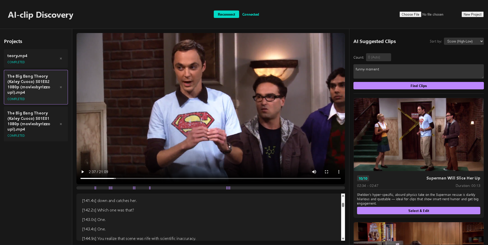
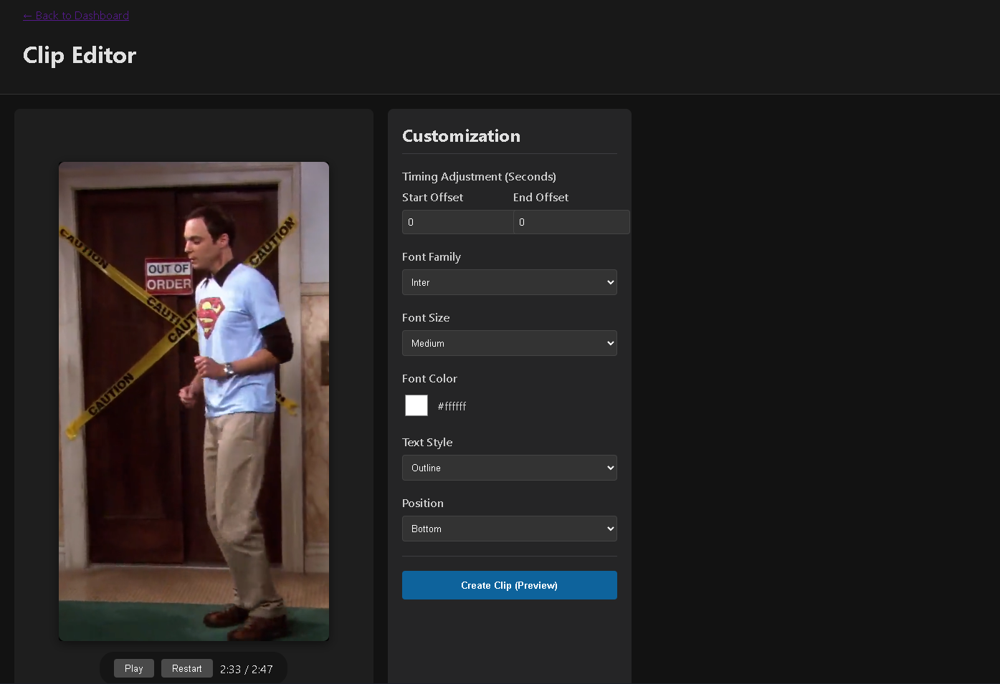

<div align="center">
  <h1>🎬 AI-clip Finder</h1>
  <p><strong>Transform long-form videos into viral vertical clips instantly using the power of AI.</strong></p>

  [![Built With pollinations.ai](https://img.shields.io/badge/Built%20with-Pollinations-8a2be2?style=for-the-badge&logo=data:image/png;base64,iVBORw0KGgoAAAANSUhEUgAAADIAAAAyCAMAAAAp4XiDAAAC61BMVEUAAAAdHR0AAAD+/v7X19cAAAD8/Pz+/v7+/v4AAAD+/v7+/v7+/v75+fn5+fn+/v7+/v7Jycn+/v7+/v7+/v77+/v+/v77+/v8/PwFBQXp6enR0dHOzs719fXW1tbu7u7+/v7+/v7+/v79/f3+/v7+/v78/Pz6+vr19fVzc3P9/f3R0dH+/v7o6OicnJwEBAQMDAzh4eHx8fH+/v7n5+f+/v7z8/PR0dH39/fX19fFxcWvr6/+/v7IyMjv7+/y8vKOjo5/f39hYWFoaGjx8fGJiYlCQkL+/v69vb13d3dAQEAxMTGoqKj9/f3X19cDAwP4+PgCAgK2traTk5MKCgr29vacnJwAAADx8fH19fXc3Nz9/f3FxcXy8vLAwMDJycnl5eXPz8/6+vrf39+5ubnx8fHt7e3+/v61tbX39/fAwMDR0dHe3t7BwcHQ0NCysrLW1tb09PT+/v6bm5vv7+/b29uysrKWlpaLi4vh4eGDg4PExMT+/v6rq6vn5+d8fHxycnL+/v76+vq8vLyvr6+JiYlnZ2fj4+Nubm7+/v7+/v7p6enX19epqamBgYG8vLydnZ3+/v7U1NRYWFiqqqqbm5svLy+fn5+RkZEpKSkKCgrz8/OsrKwcHByVlZVUVFT5+flKSkr19fXDw8Py8vLJycn4+Pj8/PywsLDg4ODb29vFxcXp6ene3t7r6+v29vbj4+PZ2dnS0tL09PTGxsbo6Ojg4OCvr6/Gxsbu7u7a2trn5+fExMSjo6O8vLz19fWNjY3e3t6srKzz8/PBwcHY2Nj19fW+vr6Pj4+goKCTk5O7u7u0tLTT09ORkZHe3t7CwsKDg4NsbGyurq5nZ2fOzs7GxsZlZWVcXFz+/v5UVFRUVFS8vLx5eXnY2NhYWFipqanX19dVVVXGxsampqZUVFRycnI6Ojr+/v4AAAD////8/Pz6+vr29vbt7e3q6urS0tLl5eX+/v7w8PD09PTy8vLc3Nzn5+fU1NTdRJUhAAAA6nRSTlMABhDJ3A72zYsJ8uWhJxX66+bc0b2Qd2U+KQn++/jw7sXBubCsppWJh2hROjYwJyEa/v38+O/t7Onp5t3VyMGckHRyYF1ZVkxLSEJAOi4mJSIgHBoTEhIMBvz6+Pb09PLw5N/e3Nra19bV1NLPxsXFxMO1sq6urqmloJuamZWUi4mAfnx1dHNycW9paWdmY2FgWVVVVEpIQjQzMSsrKCMfFhQN+/f38O/v7u3s6+fm5eLh3t3d1dPR0M7Kx8HAu7q4s7Oxraelo6OflouFgoJ/fn59e3t0bWlmXlpYVFBISEJAPDY0KignFxUg80hDAAADxUlEQVRIx92VVZhSQRiGf0BAQkEM0G3XddPu7u7u7u7u7u7u7u7u7u7W7xyEXfPSGc6RVRdW9lLfi3k+5uFl/pn5D4f+OTIsTbKSKahWEo0RwCFdkowHuDAZfZJi2NBeRwNwxXfjvblZNSJFUTz2WUnjqEiMWvmbvPXRmIDhUiiPrpQYxUJUKpU2JG1UCn0hBUn0wWxbeEYVI6R79oRKO3syRuAXmIRZJFNLo8Fn/xZsPsCRLaGSuiAfFe+m50WH+dLUSiM+DVtQm8dwh4dVtKnkYNiZM8jlZAj+3Mn+UppM/rFGQkUlKylwtbKwfQXvGZSMRomfiqfCZKUKitNdDCKagf4UgzGJKJaC8Qr1+LKMLGuyky1eqeF9laoYQvQCo1Pw2ymHSGk2reMD/UadqMxpGtktGZPb2KYbdSFS5O8eEZueKJ1QiWjRxEyp9dAarVXdwvLkZnwtGPS5YwE7LJOo...)](https://pollinations.ai)
</div>

---

**AI-clip Finder** is a high-performance FastAPI backend and vanilla JavaScript frontend designed for automated video clipping and social media content creation. It transcribes long-form videos, uses powerful LLMs to identify high-impact moments with viral potential, and renders them into eye-catching vertical (9:16) clips with dynamic, animated subtitles.

<div align="center">
  
</div>

---

## 🚀 Why AI-clip Finder?

Say goodbye to hours of tedious video editing. **AI-clip Finder** completely automates the pipeline from a raw, horizontal video to a polished, TikTok-ready short. 

- ✂️ **Automated Clipping**: Leverage cutting-edge LLMs (OpenAI via Pollinations) to analyze transcripts and intelligently pinpoint segments with the highest "viral potential."
- 📱 **Vertical Transformation**: Automatically crops and centers horizontal videos into a **9:16 aspect ratio**, optimized for TikTok, Instagram Reels, and YouTube Shorts.
- 💬 **Dynamic Subtitles**: Generates and burns in highly engaging, "karaoke-style" animated subtitles using the ASS subtitle format, keeping viewer retention high.
- ⚡ **Async Processing Engine**: Robust background task management seamlessly handles heavy media operations like compression, transcription, and rendering without blocking the user experience.
- 🌐 **Hosting & Multi-Tenant Mode**:
  - **User Isolation**: Cookie-based session management for secure multi-tenant deployments.
  - **Resource Management**: Configurable file size limits and project expiration.
  - **Automated Lifecycle**: Background tasks autonomously clean up expired and orphaned projects to keep your server lean.

---

## 🚧 The Clip Editor (Work in Progress)

We are actively building a dedicated **Clip Editor** interface! While the automated backend handles the heavy lifting, the upcoming editor will give users granular control over their clips before final rendering.

<div align="center">
  
  <p><em>Sneak peek at the WIP interactive Clip Editor</em></p>
</div>

*Features currently in development for the editor include:*
- Fine-tuning start/end times.
- Editing subtitle text and sentence structures.
- Customizing visual crop zones and tracking.

---

## 🔑 BYOP (Bring Your Own Pollen) - Zero Server AI Costs

This application utilizes a brilliant **Bring Your Own Pollen** model, ensuring that **Server AI costs remain exactly $0**.

1. Users click **"Connect with Pollinations"** in the app header.
2. They are securely redirected to [enter.pollinations.ai](https://enter.pollinations.ai) to authorize the app.
3. Their personal API key is stored locally in their browser (`localStorage`) and sent alongside requests.
4. All AI costs (transcription, LLM clip analysis) are directly billed to the user's Pollinations account.
5. Keys naturally expire after 30 days for security—users simply reconnect to refresh.

---

## 🛠️ Tech Stack

- **Backend Framework**: [FastAPI](https://fastapi.tiangolo.com/) (Python 3.10+)
- **Frontend**: Vanilla HTML5, CSS3, JavaScript (No heavy build steps!)
- **Package Manager**: [uv](https://github.com/astral-sh/uv) (Blazing fast dependency resolution)
- **Media Engine**: [FFmpeg](https://ffmpeg.org/) & [FFprobe](https://ffmpeg.org/ffprobe.html)
- **AI Services**:
  - **Transcription**: Pollinations Whisper / Scribe (via user-provided key)
  - **Analysis**: Pollinations LLMs (via user-provided key)

---

## 📂 Project Structure

```text
AI-Clip-Finder/
├── app/
│   ├── api/            # FastAPI Endpoints & Pydantic Models
│   ├── core/           # Configuration & Settings (Environment variables)
│   ├── services/       # Core Business Logic (Media processing, LLM, Transcription)
│   ├── static/         # Frontend SPA (HTML/JS/CSS)
│   ├── main.py         # Application Entry Point
│   └── middleware.py   # Hosting & Security Middleware
├── data/               # Local Storage (Projects, Index, Locks - generated)
├── previews/           # README image assets
├── tests/              # Comprehensive Test Suite (pytest)
├── requirements.txt    # Python Dependencies
├── .env.example        # Environment Variables Template
└── run.bat             # One-click Start (Windows)
```

---

## ⚡ Getting Started

### Prerequisites

- **Python 3.10+**
- **FFmpeg**: Must be installed and available in your system's `PATH`.
- **uv**: Highly recommended for fast dependency management (`pip install uv`).

### Installation & Run

#### 🖥️ Windows (Recommended)

Simply run the provided batch file for a one-click setup and start:

```cmd
run.bat
```

#### 🐧 Manual Setup (Mac/Linux/Windows)

1. **Initialize Environment**:
   ```bash
   uv venv
   source .venv/bin/activate  # On Windows: .venv\Scripts\activate
   ```

2. **Install Dependencies**:
   ```bash
   uv pip install -r requirements.txt
   ```

3. **Configure Environment**:
   Create a `.env` file in the root directory:
   ```env
   POLLINATIONS_APP_KEY=pk_your_app_key_here
   HOSTING=false             # Set to true for multi-user mode
   ```

4. **Start the Server**:
   ```bash
   uv run uvicorn app.main:app --reload
   ```

5. **Open the App**:
   Navigate to `http://localhost:8000/static/index.html` in your browser.

---

## 📡 API Overview

### 📁 Projects
- `POST /projects`: Create a new clipping project.
- `GET /projects`: List all projects (filtered by user session if `HOSTING=true`).
- `POST /projects/{id}/upload`: Upload video file (triggers background compression).
- `POST /projects/{id}/transcribe`: Extract audio and generate transcript via Pollinations.
- `POST /projects/{id}/analyze`: Discover potential viral clips using LLMs.
- `GET /projects/{id}/status`: Check progress of background operations.

### 🎬 Clips & Rendering
- `POST /api/clips/render-preview`: Fast render of a clip for quick review.
- `POST /api/clips/render-final`: High-quality render of the final, polished clip.
- `GET /api/clips/render-status/{task_id}`: Track rendering progress.
- `GET /api/clips/download/{task_id}`: Download the rendered MP4 file.

---

## ⚙️ Configuration

Control the application behavior by tweaking the `.env` variables:

| Variable               | Default        | Description                                    |
| ---------------------- | -------------- | ---------------------------------------------- |
| `HOSTING`              | `false`        | Enables user isolation and file size limits.   |
| `MAX_FILE_SIZE`        | `500MB`        | Max upload size in hosting mode.               |
| `PROJECT_EXPIRY_DAYS`  | `30`           | Days until a project is automatically deleted. |
| `LLM_MODEL`            | `openai`       | Model used for clip discovery.                 |
| `LLM_BASE_URL`         | `Pollinations` | API endpoint for LLM analysis.                 |
| `POLLINATIONS_APP_KEY` | `(empty)`      | Publishable key for Pollinations auth redirect.|

---

## 🧪 Testing

The project includes a comprehensive test suite to ensure stability. Run tests using `pytest`:

```bash
uv run pytest
```

---

<div align="center">
  <em>Built with ❤️ by the AI-clip Team.</em>
</div>
